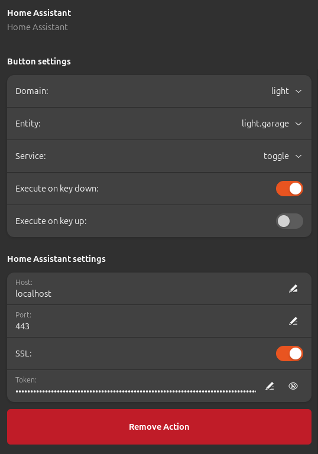

# HomeAssistantPlugin for [StreamController](https://github.com/StreamController/StreamController)
Control your Home Assistant instance from your StreamDeck

__This is no official plugin - I have no affiliation with Home Assistant, StreamDeck or StreamController.__

## Prerequisites
* `websocket_api` must be present in your `configuration.yaml`. Remember to restart Home Assistant after updating your configuration.
* You need a _long-lived access token_ to connect to Home Assistant. To create one, go to your user profile and click on the _Security_ tab. All the way at the bottom of the page is a button to create a new token. You can only see/copy the token immediately after creating it. Once you dismiss the dialog, you won't be able to retrieve the token.  
  __Be very careful with your Home Assistant information and your token. If your Home Assistant instance is accessible from the internet, anyone with this information can access and control your Home Assistant instance.__

## Examples

### Weather button
  
A button showing the current weather with no service attached.
#### Actions:
* Just one to show the weather text.

 

### Toggle button
  
A button showing the icon of an _input_boolean_. Pressing the button calls the service _toggle_ on the _input_boolean_ and the color changes according to the state.
#### Actions:
* Just one to show the icon of the entity and call the service.

 

### Media Player button
  
A button to control a media player and show media info.
#### Actions:
* The first action shows the media player icon, which is set according to the current media player state and the service selected for the button. In this case the service _media_play_pause_ is selected so if the state is _paused_ the icon is the play icon, otherwise the pause icon is shown.  
  This action also shows the current media title at the bottom.  
* The second action shows the media artist of the same entity at the top.

 

### Air quality button
  
A button to show and control air quality.
#### Actions:
* The first action shows the text and unit of measurement of a CO2 sensor with line break between value and unit.
* The second action shows the icon of a ventilator in the same room at 50% opacity.  
  Pressing the button also toggles the ventilator on/off.

## Features
* Connect to your Home Assistant instance
* Select a domain and entity
* Option to call a service
  * Supported parameters for the service can be provided for the service call
    * Whether the entity supports the provided parameters is up to you
  * The service is always called on `key_down`, i.e. immediately when the button is pressed
    * To change this behavior, the built-in `Event Assigner` can be used to
      * map other events to `key_down`, if you want to call the service on a different event (multiple events are possible)
      * map `key_down` to `None`, if you don't want to call the service on `key_down`
* Option to show the entity icon
  * If the entity's state is _on_, the icon is shown in yellow
    * If the entity's state changes, the color is updated on the StreamDeck
  * Scale and opacity of the icon are customizable
  * If the entity is a media player, the icon is instead reflecting the selected service
* Option to show entity state or attribute text
  * If the entity's state changes, the text is updated on the StreamDeck
  * Position and size of the text are customizable
  * Option to show unit of measurement (with or without line break)
* Automatic connection retries when the connection is lost
  * every 10 seconds for the first two minutes
  * then every minute for the first hour
  * every 5 minutes after that

## Planned features
* Option to change icon color
* Option to customize text
* Improve input options for service parameters (sliders etc.)

## Problems?
* Please open a [GitHub issue](https://github.com/gensyn/de_gensyn_HomeAssistantPlugin/issues).
