# HomeAssistantPlugin for [StreamController](https://github.com/StreamController/StreamController)
Control your Home Assistant instance from your StreamDeck

__This is no official plugin - I have no affiliation with Home Assistant, StreamDeck or StreamController.__

## Prerequisites
* `websocket_api` must be present in your `configuration.yaml`. Remember to restart Home Assistant after updating your configuration.
* You need a _long-lived access token_ to connect to Home Assistant. To create one, go to your user profile and click on the _Security_ tab. All the way at the bottom of the page is a button to create a new token. You can only see/copy the token immediately after creating it. Once you dismiss the dialog, you won't be able to retrieve the token.  
  __Be very careful with your Home Assistant information and your token. If your Home Assistant instance is accessible from the internet, anyone with this information can access and control your Home Assistant instance.__

## Features
* Connect to your Home Assistant instance
* Select a domain and entity
* Option to call a service
  * Parameters for the service can be provided for the service call
  * The service is always called on `key_down`, i.e. immediately when the button is pressed
    * To change this behavior, the built-in `Event Assigner` can be used to
      * map other events to `key_down`, if you want to call the service on a different event (multiple events are possible)
      * map `key_down` to `None`, if you don't want to call the service on `key_down`
* Option to show the entity icon or a user-defined icon
  * Color, scale and opacity of the icon can be set as well
  * All icon settings can be customized based on state or attribute values
    * Customizations are reevaluated on every entity update
* Option to show the entity state or an attribute value as text
  * If the entity's state changes, the text is updated on the StreamDeck
  * Position, text size, text color, outline size and outline color of the text can be set as well
  * Option to show unit of measurement (with or without line break)
  * All text settings can be customized based on state or attribute values
    * Customizations are reevaluated on every entity update
* Automatic connection retries when the connection is lost

## Documentation

### Plugin settings
To open the Home Assistant plugin settings, open your _StreamController settings_ and select the tab
_Plugins_. Look for the entry for _Home Assistant_ and click _Open Settings_.

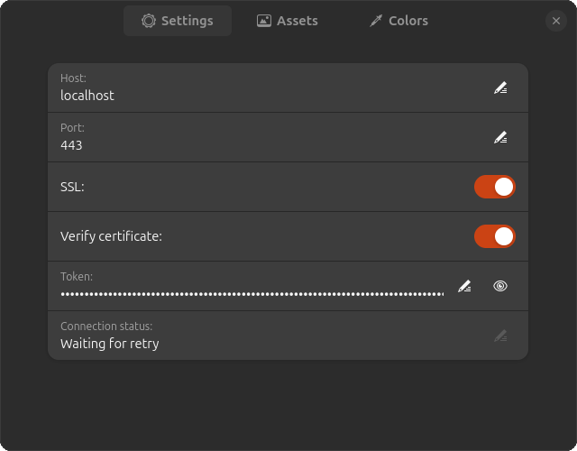

Once all necessary information is entered, the plugin automatically tries to connect to Home
Assistant. If you are using a self-signed certificate, you should disable _Verify certificate_
or the connection will fail.  
If the connection can't be established or is lost, the plugin automatically tries to reconnect:
  * every 10 seconds for the first two minutes
  * then every minute for the first hour
  * every 5 minutes after that

## Action settings
Located within each action are settings that allow you to call Home Assistant services or show
icons or text of Home Assistant entities (or possibly all three). 

### Dial Control Action
This action type is designed for devices with rotational dials, such as the Stream Deck+. It allows you to control Home Assistant entities by rotating the dial.

### Action entity
First you need to pick an entity for your action.

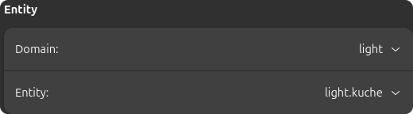

### Action service
If you want to call a service when pressing the key on your Stream Deck, activate the _Call service_
switch.

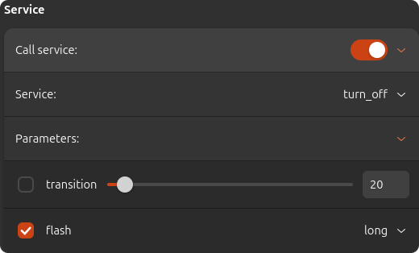

You can then pick the service and optionally set parameters for the service call. The list of
parameters contains all possible parameters for the service; this does not guarantee, that the
entity supports the parameter.  
Only settings where the checkbox on the left is checked are honored.

### Action icon
If you want to show an icon on the key, activate the _Show icon_ switch.

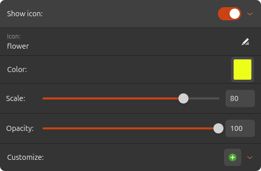

By default, this shows the icon defined in Home Assistant for the entity, or nothing, if no icon is
defined. In the _Icon_ field you can define an icon which overrides the setting from Home Assistant.
Valid are all icons from the [Material Design Icon](https://pictogrammers.com/library/mdi/)
collection.  
You can also adapt color, scale and opacity of the icon there.

#### Action icon customization
To create a new icon customization, click the button (
)  in the _Customize_
row. A new window opens where you can enter a condition and how the icon should change if the
condition is met.

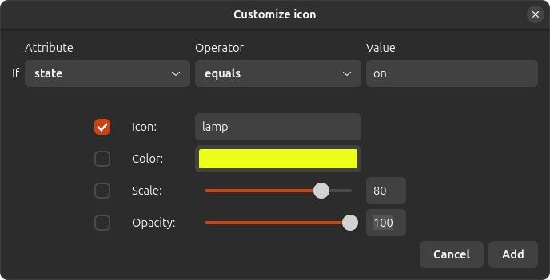

Only settings where the checkbox on the left is checked are honored.  
When you have created customizations, they are shown in the _Icon_ section as well.

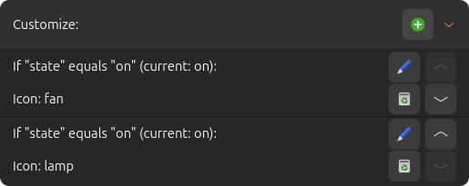

Customizations are cascading and evaluated in order. This means, multiple customizations might have
conditions that are met, but the latest matching customization sets the eventual value for an
option. In the example above, both customizations' conditions are met, but the icon shown would be
_lamp_ as this is the latest matching customization.  
For convenience, the current value that the condition is evaluated against, is also shown, and with
the buttons, you can edit, delete and rearrange your customizations.

### Action text
If you want to show text on the key, activate the _Show text_ switch.

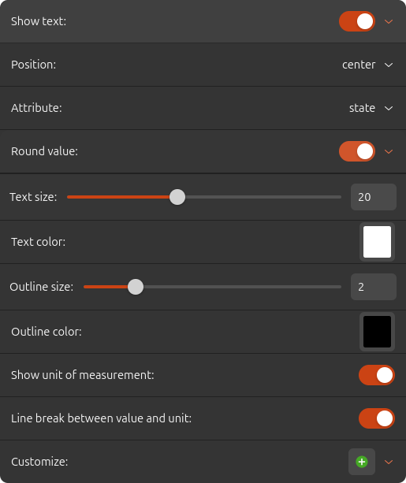

With _Position_ you can change where on the key the text is shown. _Attribute_ allows you to change
what value of the entity is displayed; either the state, or the value of an attribute.  
When _Round value_ is active, the plugin tries to convert the value to a float number and round it
to the defined _Precision_. This has no effect if the value cannot be converted.  
_Text size_ and _Outline size_ change the size of the text and the outline respectively and the same
goes for _Text color_ and _Outline color_ but for color.  
If the entity state is picked to be displayed and the entity has a unit of measurement set in Home
Assistant, the option _Show unit of measurement_ becomes available. When the option is activated,
additionally the option _Line break between value and unit_ becomes available as well. They do
exactly what the labels say.

#### Action text customization
To create a new text customization, click the button (
)  in the _Customize_
row. A new window opens where you can enter a condition and how the text should change if the
condition is met.

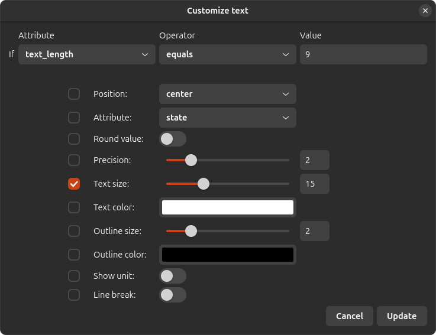

Only settings where the checkbox on the left is checked are honored.  
When you have created customizations, they are shown in the _Text_ section as well.

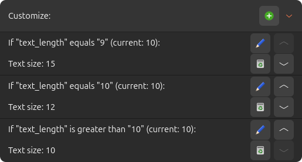

Just as with icon customization, text customizations are cascading and evaluated in order.
This means, multiple customizations might have conditions that are met, but the latest matching
customization sets the eventual value for an option. In the example above, only the second
customization matches the condition so the text size is set to 12.  
For convenience, the current value that the condition is evaluated against, is also shown, and with
the buttons, you can edit, delete and rearrange your customizations.

## Examples

### Weather button
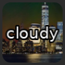  
A button showing the current weather with no service attached.
#### Actions:
* Just one to show the weather text.

 

### Toggle button
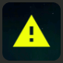  
A button showing the icon of an _input_boolean_. Pressing the button calls the service _toggle_ on the _input_boolean_ and the color changes according to the state.
#### Actions:
* Just one to show the icon of the entity and call the service.

 

### Media Player button
  
A button to control a media player and show media info.
#### Actions:
* The first action shows the media player icon, which is set according to the current media player state and the service selected for the button. In this case the service _media_play_pause_ is selected so if the state is _paused_ the icon is the play icon, otherwise the pause icon is shown.  
  This action also shows the current media title at the bottom.  
* The second action shows the media artist of the same entity at the top.

 

### Air quality button
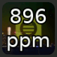  
A button to show and control air quality.
#### Actions:
* The first action shows the text and unit of measurement of a CO2 sensor with line break between value and unit.
* The second action shows the icon of a ventilator in the same room at 50% opacity.  
  Pressing the button also toggles the ventilator on/off.

## Planned features
* None at the moment

## Problems?
* Please open a [GitHub issue](https://github.com/gensyn/de_gensyn_HomeAssistantPlugin/issues).
